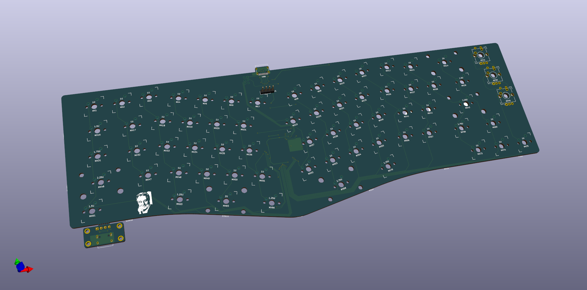

# Agathe
Another Alice-clone

Following a 65% approach with close arrow-cluster and support for rotary encoders



All the pcb files are created in Kicad, you can find everything in the root folder.

## Development

clone this repos with submodules
```
git clone --recurse-submodule https://github.com/louckousse/Agathe.git
```

## Building
When building this keyboard if you want to use the one rotary encoders you'll have to solder the jumper between the middle pad to the pad 1. If you want to use multiple, solder the other way around and check [this pr](https://github.com/qmk/qmk_firmware/pull/7209).


## Keymap
You can find the keymap under my [QMK fork](https://github.com/louckousse/keymaps/tree/main/agathe).

# License
This work is licensed under a [Attribution-NonCommercial-ShareAlike 4.0 International (CC BY-NC-SA 4.0)](https://creativecommons.org/licenses/by-nc-sa/4.0/).
